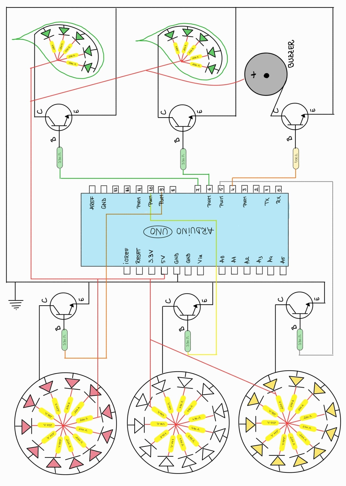

# Platforma mobilă cu elemente animatronice 🌷🦋

## Descriere generală
Proiectul constă în realizarea unui robot mobil pe **șasiu 4WD**, controlat wireless, care integrează două elemente mecanice animate sub forma unor fluturi cu aripi mobile și un sistem de iluminare dinamică. Platforma mobilă este alcătuită din patru motoare DC cu reductor, montate câte unul pe fiecare roată. Deplasarea se realizează prin control diferențial stânga–dreapta, permițând mișcări înainte, înapoi și rotație pe loc cu o telecomandă. Cele două comunică prin **modulul radio nRF24L01**.

Elementele centrale ale proiectului sunt fluturii, acționați de câte un motor DC cu reductor de tip N20. Motorul antrenează un mecanism de conversie rotație–translație (excentric-bielă), care transformă mișcarea continuă de rotație în mișcare alternativă a aripilor. Acestora li se adaugă un ansamblu de 43 de LED-uri și un buzzer pasiv, coordonate pentru a crea un spectacol de lumini și sunet sincronizat.

Proiectul demonstrează integrarea controlului electronic, a mecanismelor simple și a comunicației wireless într-un sistem funcțional coerent, fără a depinde de modele aerodinamice complexe.

## 🛠️ Componente

*Notă: Folosiți CTRL+Click pentru a deschide link-urile de mai jos în tab-uri noi.*

| Componentă | Cantitate | Rol |
| :--- | :---: | :--- |
| ⚡️ **ELECTRONICE** | | |
| <a href="https://www.emag.ro/driver-motor-tip-tb6612fng-ai0383-s299/pd/D6QW8GMBM/?ref=history-shopping_465680196_236249_1" target="_blank">Driver motor, tip TB6612FNG</a> | 1 | Controlul motoarelor de pe șasiu. <a href="https://cdn.sparkfun.com/datasheets/Robotics/TB6612FNG.pdf" target="_blank">Datasheet</a> |
| <a href="https://www.emag.ro/sasiu-dublu-masina-inteligenta-cu-4-roti-3874784221220/pd/DWKRZKYBM/?ref=history-shopping_465680196_157633_1" target="_blank">Șasiu masina 4wd</a> | 1 | Platforma de locomoție |
| <a href="https://www.optimusdigital.ro/ro/compatibile-cu-arduino-nano/1686-placa-de-dezvoltare-compatibila-cu-arduino-nano-atmega328p-i-ch340.html?search_query=Placa+de+Dezvoltare+compatibila+cu+Arduino+Nano+%28ATmega328p+%C8%99i+CH340%29+++Cablu+30+cm&results=5" target="_blank">Placă Arduino Nano</a> | 2 | <ul><li>Unitatea centrală de procesare a robotului</li><li>Unitatea de procesare a telecomenzii</li></ul> |
| <a href="https://www.optimusdigital.ro/ro/placi-avr/4561-placa-de-dezvoltare-compatibila-cu-arduino-uno-r3-atmega328p-atmega16u2-cablu-50-cm.html?search_query=Placa+de+Dezvoltare+Compatibila+cu+Arduino+UNO+R3+%28ATmega328p+++ATmega16u2%29+++Cablu+50+cm&results=1" target="_blank">Plăcă Arduino Uno</a> | 1 | Unitatea de procesare a efectelor audio și luminoase |
| <a href="https://www.optimusdigital.ro/ro/senzori-senzori-de-atingere/742-modul-joystick-ps2-biaxial-negru-cu-5-pini.html?search_query=joystick&results=28" target="_blank">Joystick</a> | 1 | Interfața de control a direcției și vitezei |
| <a href="https://www.optimusdigital.ro/ro/ism-24-ghz/48-modul-tranceiver-nrf24l01-24-ghz.html?search_query=Modul+Transceiver+nRF24L01+%282.4+GHz%29&results=5" target="_blank">Modul Transceiver nRF24L01 (2.4 GHz)</a> | 2 | Comunicare wireless bidirecțională |
| <a href="https://www.emag.ro/placa-adaptor-modul-wireless-nrf24l01-alimentare-4-5v-9v-3-3v-dh000023/pd/DW8QQL3BM/?ref=history-shopping_471325353_245879_1" target="_blank">Placă adaptoare modul wireless NRF24L01</a> | 2 | Adaptor tensiune și stabilitate pentru radio |
| <a href="https://www.optimusdigital.ro/ro/motoare-micro-motoare-cu-reductor/678-micro-motor-cu-reductor-ga12-n20-130.html?search_query=Micro+Motor+GA12-N20+cu+Reductor+1%3A30+%C8%99i+Ax+de+10+mm&results=7" target="_blank">Micro Motor GA12-N20 (Reductor 1:30)</a> | 1 | Acționarea aripilor fluturelui mic |
| <a href="https://www.optimusdigital.ro/ro/motoare-micro-motoare-cu-reductor/676-micro-motor-cu-reductor-ga12-n20-110.html?search_query=Micro+Motor+GA12-N20+cu+Reductor+1%3A10+%C8%99i+Ax+de+10+mm&results=7" target="_blank">Micro Motor GA12-N20 (Reductor 1:10)</a> | 1 | Acționarea aripilor fluturelui mare |
| <a href="https://www.emag.ro/breadboard-400-puncte-ai059-s69/pd/DRJ66JBBM/?ref=history-shopping_465680196_38837_1" target="_blank">Breadboard 400 puncte</a> | 2 | Prototipare conexiuni |
| <a href="https://www.emag.ro/breadboard-830-puncte-mb102-ai067-s70/pd/DF0C5JBBM/?ref=history-shopping_465680196_34366_1" target="_blank">Breadboard 830 puncte</a> | 1 | Prototipare conexiuni |
| <a href="https://www.optimusdigital.ro/ro/prototipare-breadboard-uri/244-mini-breadboard-colorat.html?search_query=Mini+Breadboard+Alb&results=17" target="_blank">Mini breadboard 170 puncte</a> | 1 | Prototipare conexiuni |
| <a href="https://www.emag.ro/mufa-baterie-9v-conector-ai686-s262/pd/D9ZZ5JBBM/?ref=history-shopping_465680196_34366_2" target="_blank">Mufe baterie 9V</a> | 3 | Conexiune alimentare |
| <a href="https://www.optimusdigital.ro/ro/butoane-i-comutatoare/7377-comutator-kcd10-101.html?search_query=Comutator+KCD10-101&results=1" target="_blank">Comutator KCD10-101 (ON/OFF)</a> | 2 | Întrerupător |
| <a href="https://www.optimusdigital.ro/ro/audio-buzzere/634-buzzer-pasiv-de-5-v.html?search_query=Buzzer+Pasiv+de+5+V&results=9" target="_blank">Buzzer pasiv</a> | 1 | Semnalizare sonoră |
| <a href="https://www.optimusdigital.ro/ro/componente-electronice-tranzistoare/935-tranzistor-s9013-npn-50-pcs-set.html?search_query=Tranzistor+NPN+2n2222+TO-92&results=4" target="_blank">Tranzistori NPN 2n2222</a> | 6 | Amplificare semnal (LED/Buzzer) |
| <a href="https://www.optimusdigital.ro/ro/drivere-de-motoare-cu-perii/13613-driver-de-motoare-l293d.html?search_query=Driver+de+Motoare+L293D&results=6" target="_blank">Driver L293D</a> | 1 | Controlarea motoarelor fluturilor |
| LED-uri albe (+ rezistențe 470Ω) | 11 | Iluminare |
| LED-uri roșii (+ rezistențe 220Ω) | 11 | Iluminare |
| LED-uri galbene (+ rezistențe 220Ω) | 11 | Iluminare |
| LED-uri verzi (+ rezistențe 220Ω) | 10 | Iluminare |
| Baterii 9V | 3 | Alimentare logică și motoare |
| Baterii 1.5V | 4 | Alimentarea motoarelor șasiului |
| 🎨 **ELEMENTE DECORATIVE ȘI DE FIXARE** | | |
| Spumă EVA | - | Pentru realizarea fluturilor |
| Fetru | - | Pentru realizarea florilor |
| Zip ties | - | Pentru fixarea componentelor |
| Șuruburi și piulițe | - | Pentru fixarea componentelor |
| Sârmă | - | Elemente structurale |
| Discuri metalice (2.5cm) | 2 | Pentru excentric |
| Tije de lemn (~10cm) | 2 | Suport pentru motoarele fluturilor |

## Detalii tehnice și arhitectură

### Sursa de inspirație

Acest proiect este o adaptare bazată pe multiple resurse, combinând robotica cu elementele mecanice și efecte sonore. 
* <a href="https://www.instructables.com/DIY-Joystick-Controlled-Remote-Car-Using-Arduino/" target="_blank">Locomoție</a>
* **Fluturi** <a href="https://www.youtube.com/shorts/u5PJN3zsB4Q" target="_blank">🦋</a> <a href="https://www.youtube.com/watch?v=BPetj9RztrI" target="_blank">🦋</a>
* **Sistemul audio:** piesa de fundal este o adaptare preluata de <a href="https://github.com/robsoncouto/arduino-songs/blob/master/greensleeves/greensleeves.ino" target="_blank">aici</a> 

### Ce aduce nou acest proiect?

Față de tutorialele standard acest proiect aduce:

1. **Sistem animatronic sincronizat**: Integrarea a două mecanisme excentric-bielă a căror viteză este mapată software după viteza de deplasare 
2. **Arhitectura multi-driver**: Coordonarea simultana a unui driver *TB6612FNG* (pentru tracțiune) și a unui driver *L293D* (pentru elementele decorative). 
3. **Arhitectură de procesare distribuită**: Utilizarea a trei unități Arduino pentru a separa sarcinile critice (control motoare) de cele multimedia (efecte LED și Audio).
4. **Design estetic functional**: Construcția manuală a elementelor mecanice. 

### Analiza sitemului

**Q1. Care este limita sistemului?**

Limita sistemului este definită de interfața fizică a celor două module:

* **Intrare (Input):** 
  * **Control Wireless:** Traducerea mișcării mecanice a joystick-ului de către transmițător în semnale analogice (0-1023).
  * **Control Fizic (On/Off):** Interfața include două comutatoare critice plasate pe platformă:
    1. **Comutator Efecte:** Activează sistemul audio-vizual (*Arduino UNO*), permițând pornirea decorului înainte de deplasare.
    2. **Comutator Motoare:** Plasat între cele două plăci ale șasiului, acesta activează unitatea centrală (*Arduino NANO*), inițializând modului radio și controlul motoarelor.
* **Iesire (Output):** 
  * **Locomoție:** Acționarea celor 4 motoare DC.
  * **Sistem de articulare a elementelor mobile:** Mișcarea alternativă a aripilor prin cele două motoare N20.
  * **Feedback Multisenzorial:** Activarea celor 43 de LED-uri și a buzzerului pasiv.

*Notă: Robotul funcționeaza în buclă deschisa (open-loop) pentru deplasare, fără senzori de evitare a obstacolelor.*

**Q2. Unde "locuiește" inteligența?** 🧠

Procesarea este distribuită între trei noduri pentru a optimiza timpii de răspuns și a preveni blocajele de execuție:

* **Nodul de Control (*Arduino NANO RX*):** Prioritizează sarcinile critice de procesare a comenzilor wireless și controlul celor 6 motoare. 
* **Nodul Multimedia (*Arduino UNO*):** Gestionează sarcinile pentru efectele cromatice ale celor 43 de LED-uri și redarea melodiei prin mașina de stări finite.
* **Transmițător (*Arduino NANO TX*):** Citește datele analogice, le procesează și le trimite prin pachete radio.

**Q3. Care este cea mai dificilă problemă tehnică?**

Cea mai mare provocare a fost proiectarea mecanismului pentru mișcarea aripilor, trecând prin mai multe iterații de design pentru a rezolva probleme de mecanică fină.

1. ❌ **Scripete:** Inițial, pentru a simula zborul fluturelui, am dorit suspendarea acestuia pe un scripete. Am abandonat ideea înainte de a începe implementarea din cauza riscului de încâlcire a firelor motorului și a oscilațiilor necontrolate cauzate de centrul de greutate variabil.
2. ❌ **Bielă-manivelă în carcasă:** Am încercat realizarea unui sistem bielă-manivelă cu motorul și axul integrate într-o carcasă. Din cauza realizării manuale a axului, au apărut erori de centrare: tija lovea pereții carcasei și bloca mecanismul. Deblocarea ar fi necesitat o logică software complexă (rotație inversă la detecția blocajului), ineficientă în practică. 

<table>
  <tr>
    <td width="50%"></td>
    <td width="50%"></td>
  </tr>
</table>

3. ✅ **Soluția Finală (Excentric):** Am ales ideea de excentric-bielă fără carcasă restrictivă, care s-a dovedit a fi cea mai fiabilă și stabilă soluție, eliminând blocajele mecanice.

**Q4. Care este demo-ul minim funcțional?**

Sistemul trebuie să demonstreze:

* Conexiune radio bidirecțională stabilă.
* Controlul direcției (față/spate/stânga/dreapta/rotație pe loc) de la distanță.
* Activarea aripilor odată cu plecarea de pe loc și creșterea frecvenței bătăilor proporțional cu viteza șasiului.

**Q5. De ce nu este doar un simplu tutorial?**

Proiectul necesită integrare de sisteme, nu doar replicare:

* Sincronizarea a două tipuri de drivere de motor.
* Proiectare mecanică pentru conversia mișcării (excentric-bielă).
* Gestionarea a 5 surse de tensiune pentru izolarea zgomotului electromagnetic.

## ⚡️ Managementul Alimentării și Secvențierea Pornirii

Datorită utilizării a **5 surse de tensiune independente**, proiectul permite o prinire secvențială, esențială pemtru stabilitatea electronică și economisirea resurselor:

* **Sursa 1 (🎮 Telecomanda):** O baterie dedicată pentru *Arduino NANO TX* și modulul radio de emisie. Izolarea ei asigură că semnalul transmis rămâne curat, indiferent de consumul robotului.
  * ***OBS:*** *Deși inițial a fost proiectată pentru o baterie de **9V**, am constatat că aceasta nu oferă curentul necesar pentru stabilitatea modului radio în momentul transmisiei datelor.*
    * **Soluție implementată:** Pentru o funcționare stabilă, telecomanda utilizează o ***baterie externă (Power Bank)*** sau conectare directă la **laptop via USB**. Aceasta asigură cei **5V** necesari plăcii *Arduino NANO* și un curent constant pentru modulul **nRF24L01**.
* **Sursa 2 (🚨 Ambient/Efecte - 9V):** Prin acționarea primului buton ON/OFF, se alimentează *Arduino UNO*. Se inițializează mașina de stări pentru LED-uri și începe redarea melodiei.
* **Sursa 3 (📡 Receptor - 9V):** Prin actionarea celui de-al doilea buton ON/OFF, plasat între plăcile șasiului, se alimentează *Arduino NANO RX*. Acesta stabilește conexiunea cu telecomanda.
* **Sursa 4 (🚗 Tracțiune - 6V):** Pachet de 4 baterii **1.5V** dedicate exclusiv driverului *TB6612FNG* și celor 4 motoare ale șasiului.
* **Sursa 5 (🦋 Fluturi - 9V):** O baterie dedicată driverului *L293D* pentru acționarea motoarelor **N20**. Tensiunea de **9V** este esențială aici pentru a compensa căderea de tensiune internă a driverului *L293D* și a menține cuplul necesar aripilor.

## 🛡️ Securitatea Comunicației și Evitarea Interferențelor

Deoarece modulele **nRF24L01** operează în bandă liberă de 2.4GHz, există riscul de interferență în medii cu mai multe dispozitive similare. Pentru a preveni controlul accidental de către alte transmițătoare, proiectul utilizează:
* **Adresare Unică:** O adresă specifică de 5 octeți care acționează ca un filtru pentru pachetele de date.
* **Selectarea Canalului:** Posibilitatea de a schimba canalul RF (drecvența de lucru) pentru a evita zonele aglomerate ale spectrului radio.

## ⚙️ Logica de Sincronizare Animatronică

Viteza de mișcare a aripilor este controlată dinamic în funcție de viteza de deplasare a platformei. Această corelație este definită prin următoarea formulă de mapare: 

$$PWM_{fluturi} = (Viteza_{auto} - PWM_{MIN}) \times \frac{PWM_{MAX} - minWingsSpeed}{PWM_{MAX} - PWM_{MIN}} + minWingsSpeed$$

Parametrii utilizați în cod: 
* $PWM_{MIN} = 0$: Limita inferioară a semnalului PWM.
* $PWM_{MAX} = 255$: Limita superioară pentru Arduino.
* $minWingsSpeed = 90$: Pragul minim pentru a învinge inerția motoarelor N20.
* $Viteza_{auto}$: Valoarea curentă a vitezei șasiului (currentSpeed)

## 📂 Biblioteci utilizate

Pentru a rula acest proiect, este necesară instalarea următoarelor biblioteci în Arduino IDE:
* **RF24 (by TMRh20):** Aceasta este biblioteca principală care trebuie instalată din *Library Manager*. Ea conține atât fișierul **RF24.h**, cât și **nRF24L01.h**. Fără instalarea acestui pachet specific, codul nu se va compila.
* **SPI:** Aceasta este o bibliotecă standard a mediului Arduino. Este necesară deoarece modulul radio comunică cu placa Arduino prin protocolul *Serial Peripheral Interface (SPI)*.

## 📸 Galerie Foto & Video 🎥
### Scheme electrice:

<table>
  <tr>
    <td width="50%"></td>
    <td width="50%"></td>
  </tr>
  <tr>
    <td colspan="2">
      
    </td>
  </tr>
</table>

### Montaje:

<table>
  <tr>
    <td width="25%"></td>
    <td width="25%"></td>
    <td width="25%"></td>
    <td width="25%"></td>
  </tr>
  <tr>
    <td width="25%"></td>
    <td width="25%"></td>
    <td width="25%"></td>
    <td width="25%"></td>
  </tr>
  <tr>
    <td width="25%"></td>
    <td width="25%"></td>
    <td width="25%"></td>
    <td width="25%"></td>
  </tr>
  <tr>
    <td width="25%"></td>
    <td width="25%"></td>
    <td width="25%"></td>
    <td width="25%"></td>
  </tr>
  <tr>
    <td width="25%"></td>
    <td width="25%"></td>
    <td width="25%"></td>
    <td width="25%"></td>
  </tr>
  <tr>
    <td colspan="4">
      
    </td>
  </tr>
</table>

### Demo: 

[**Cod Platforma**](Cod/platforma.ino) 
[**Cod Telecomanda**](Cod/telecomanda.ino) 
[**Cod Efecte**](Cod/efecte_luminoase_si_audio.ino) 